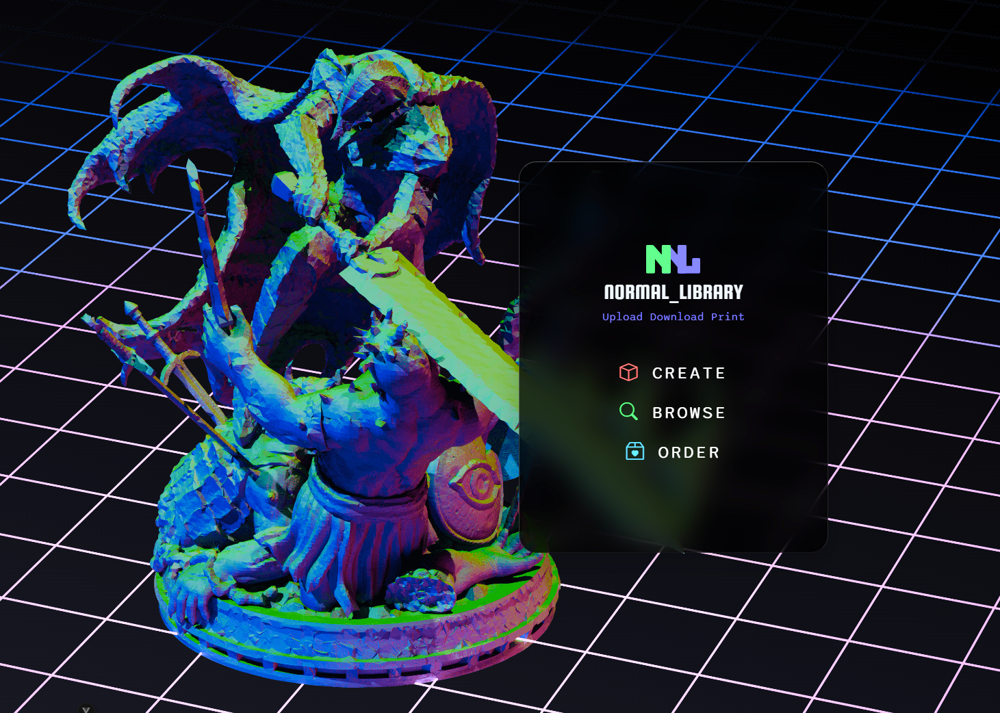
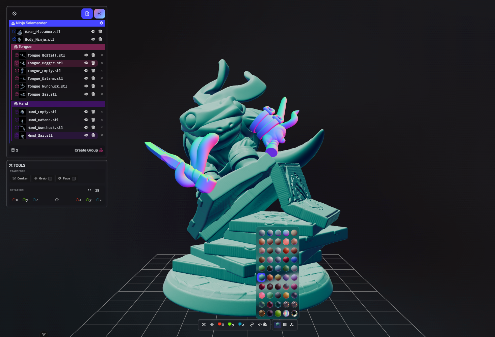

### Howdy 🤠

#### I am a Full-Stack developer and Instructor with a deep passion for learning and teaching. I am always looking to expand my knowledge with new languages on all sorts of projects.

#### Apart from coding, I am an avid gamer, dungeon master, design snob and digital artist. I like to build apps around my interests and I am always trying to implement some sort of artwork into my designs.

🔭 I’m currently working on an app to upload, browse and order 3D printing models

  
  

🌱 I’m currently learning more python. It's a language I have little experience with but enjoy working with.

[)](https://github.com/MickShannahan/github-readme-stats)

<!--
**MickShannahan/MickShannahan** is a ✨ _special_ ✨ repository because its `README.md` (this file) appears on your GitHub profile.

Here are some ideas to get you started:

- 👯 I’m looking to collaborate on ...
- 🤔 I’m looking for help with ...
- 💬 Ask me about ...
- 📫 How to reach me: ...
- 😄 Pronouns: ...
- ⚡ Fun fact: ...
-->
